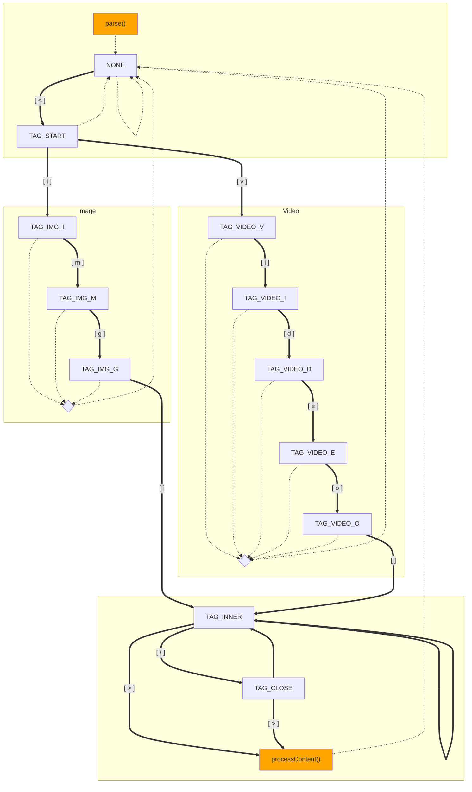

**Note:**
Tomcat may redirect requests sent with partial URLs, i.e.
`http://localhost:8080/simpleservlet` instead of
`http://localhost:8080/simpleservlet/`.
Redirected request method may change to `GET`, losing original content.

* Function to send HTTP requests with PowerShell 1.0:

```powershell
function Send-Request ([string] $url, [string] $method = "GET", [byte[]] $content = $null, [string] $contentType = $null) {
    $request = [System.Net.WebRequest]::Create($url)
    $request.Method = $method

    if ($method -ieq "POST" -and $content -ne $null) {
        $request.ContentType = $contentType
        $request.ContentLength = $content.Length

        $stream = $request.GetRequestStream()
        $stream.Write($content, 0, $content.Length)
        $stream.Flush()
        $stream.Close()
    }
    try {
        $response = $request.GetResponse()
        $stream = $response.GetResponseStream()
        $reader = New-Object -TypeName "System.IO.StreamReader" -ArgumentList $stream
        $result = $reader.ReadToEnd()
        $reader.Close()
    }
    catch {
        $result = $_.ToString()
    }
    return $result
}
```

* HTML form to send `multipart/form-data` requests:

```html
<form action="http://localhost:8080/simpleservlet/" method="post" enctype="multipart/form-data">
    <p><input type="text" name="text">
    <p><input type="file" name="file">
    <p><button type="submit">Submit</button>
</form>
```

* `server.xml` snippet to [configure SSL](https://tomcat.apache.org/tomcat-9.0-doc/ssl-howto.html):

```xml
<Connector protocol="org.apache.coyote.http11.Http11NioProtocol"
           secure="true" scheme="https" port="8443"
           keystoreFile="${user.home}/.keystore"
           keystorePass="changeit"
           SSLEnabled="true" />
```

**Note:**
`${user.home}` points to the current user's home directory.

* State diagram corresponding to the
[`Parser`](src/simpleservlet/util/parsing/Parser.java) and
[`ParserMap`](src/simpleservlet/util/parsing/ParserMap.java):


