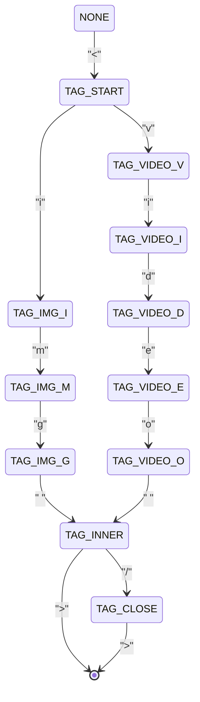

```mermaid
stateDiagram

id0001: NONE
id0002: TAG_START
id0004: TAG_INNER
id0008: TAG_CLOSE

id0020: TAG_IMG_I
id0040: TAG_IMG_M
id0080: TAG_IMG_G

id0400: TAG_VIDEO_V
id0800: TAG_VIDEO_I
id1000: TAG_VIDEO_D
id2000: TAG_VIDEO_E
id4000: TAG_VIDEO_O

id0001 --> id0002: "<"

id0002 --> id0020: "i"
id0020 --> id0040: "m"
id0040 --> id0080: "g"
id0080 --> id0004: " "

id0002 --> id0400: "v"
id0400 --> id0800: "i"
id0800 --> id1000: "d"
id1000 --> id2000: "e"
id2000 --> id4000: "o"
id4000 --> id0004: " "

id0004 --> id0008: "/"
id0004 --> [*]: ">"
id0008 --> [*]: ">"
```
